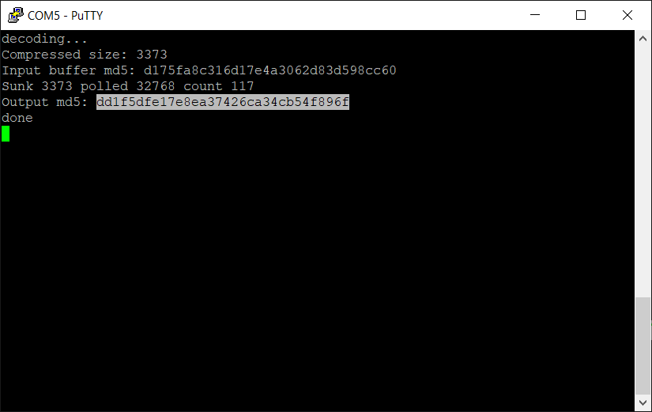

Take the md5 checksum of the input test file `octo1.raw`

`md5sum heatshrink/sampledata/octo1.raw`
`dd1f5dfe17e8ea37426ca34cb54f896f  heatshrink/sampledata/octo1.raw`

Compress test file `octo1.raw` with:

`heatshrink -e -w 8 -l 4 octo1.raw octo1.raw.lzh`

Create C source out of it:

`xxd -i octo1.raw.lzh > octo1.c`

Run a terminal program such as Putty configured at 115200, 8N1.
Build and run STM32 application with Keil. If using IAR or GCC, just regenerate project with CubeMX.
Check on serial output if the checksum of the decoded buffer is the same as the one computed above:

